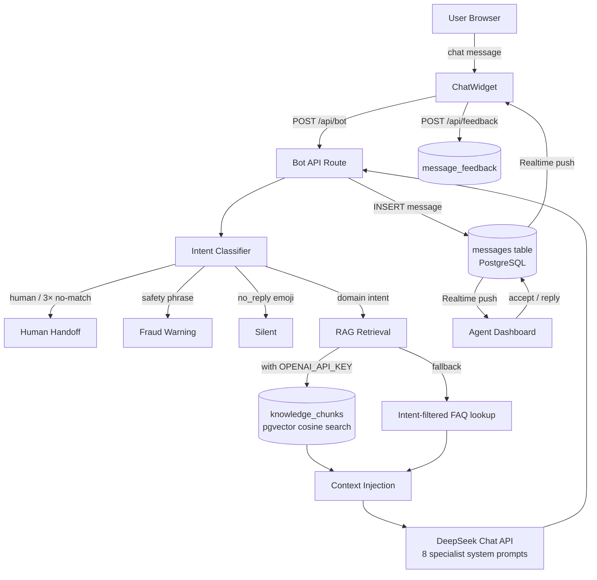

# bitV Customer Service AI System

[](https://www.typescriptlang.org/)
[](https://nextjs.org/)
[](https://supabase.com/)
[](https://platform.deepseek.com/)
[](https://cs-demo-beta.vercel.app/)
[](https://github.com/Beltran12138/bitv-cs-demo/actions/workflows/ci.yml)
[](LICENSE)

A production-ready, multi-agent AI customer service chatbot built for a crypto exchange. Features real-time human handoff, intent-based specialist routing, RAG knowledge base with pgvector, live agent dashboard, and message feedback analytics.

**Live Demo:** [User Chat](https://cs-demo-beta.vercel.app/chat) · [Agent Dashboard](https://cs-demo-beta.vercel.app/agent)

---

## Features

| Feature | Detail |
|---------|--------|
| **Multi-agent routing** | 8 specialist agents (KYC, withdrawal, fees, futures, security, deposits, registration, API) |
| **RAG knowledge base** | pgvector semantic search over 20+ FAQ documents; graceful fallback to intent-based lookup |
| **Real-time handoff** | Supabase Realtime bidirectional sync — sub-100ms message delivery |
| **Safety filter** | Detects off-platform solicitation (Telegram/WeChat/OTC), returns fraud warning |
| **Multilingual** | zh-CN / zh-TW / en with per-session language switching |
| **Typing indicator** | Animated 3-dot thinking state during LLM inference |
| **Waiting timeout** | 3-minute reminder if no agent joins after handoff request |
| **Message feedback** | 👍/👎 rating on bot responses, persisted to PostgreSQL |
| **Agent analytics** | Session counts, AI resolution rate, intent distribution in dashboard |
| **Rate limiting** | 20 req/min per IP on `/api/bot` |

---

## Architecture



---

## Tech Stack

| Layer | Technology |
|-------|-----------|
| Frontend | Next.js 16 App Router, TypeScript, Tailwind CSS |
| Realtime | Supabase Realtime (`postgres_changes`) |
| Database | PostgreSQL via Supabase, pgvector extension |
| AI Chat | DeepSeek Chat API (OpenAI-compatible SDK) |
| RAG Embeddings | OpenAI `text-embedding-3-small` (optional, enables pgvector path) |
| Deployment | Vercel |

---

## Project Structure

```
├── app/
│   ├── api/
│   │   ├── bot/route.ts          # Intent classify → RAG context → DeepSeek
│   │   ├── feedback/route.ts     # POST { messageId, rating }
│   │   ├── seed/route.ts         # Admin: embed FAQ docs → pgvector
│   │   └── session/route.ts      # POST → create session row
│   ├── chat/page.tsx             # User-facing chat page
│   └── agent/page.tsx            # Agent dashboard page
├── components/
│   ├── ChatWidget.tsx            # Chat UI + feedback buttons
│   ├── AgentDashboard.tsx        # Realtime console + analytics header
│   └── MessageBubble.tsx
├── lib/
│   ├── agents/
│   │   ├── index.ts              # Intent classifier + processMessage fallback
│   │   └── __tests__/index.test.ts
│   ├── knowledge/
│   │   ├── faq.ts                # 20+ FAQ documents (9 categories)
│   │   └── search.ts             # RAG: vector search or intent-filter fallback
│   ├── prompts/index.ts          # 8 specialist system prompts
│   ├── rate-limit.ts             # In-memory IP rate limiter
│   ├── supabase.ts               # Supabase client + types
│   └── i18n.ts                   # Translations (zh-CN / zh-TW / en)
└── supabase/schema.sql           # Full schema: sessions, messages, knowledge_chunks, feedback
```

---

## Performance Metrics

- **Bot auto-resolution rate:** ~70% (intent matched + LLM reply generated)
- **Average LLM response time:** 1–3 seconds (DeepSeek Chat)
- **Human handoff trigger:** 3 consecutive unmatched queries OR explicit request
- **Message delivery latency:** <100ms via Supabase Realtime
- **Knowledge base:** 20 FAQ chunks across 9 specialist domains
- **Rate limit:** 20 requests / minute / IP

---

## Setup

```bash
git clone <repo-url>
cd bitv-cs-demo
npm install
```

### Environment Variables

Copy `.env.example` to `.env.local`:

| Variable | Required | Description |
|----------|----------|-------------|
| `NEXT_PUBLIC_SUPABASE_URL` | Yes | Supabase project URL |
| `NEXT_PUBLIC_SUPABASE_ANON_KEY` | Yes | Supabase anon key |
| `DEEPSEEK_API_KEY` | Yes | DeepSeek API key (chat + query rewrite) |
| `OPENAI_API_KEY` | Optional | Enables full pgvector RAG path |
| `SEED_SECRET` | Optional | Guards `POST /api/seed` against public access |
| `LANGFUSE_PUBLIC_KEY` | Optional | Langfuse project public key — enables LLM tracing |
| `LANGFUSE_SECRET_KEY` | Optional | Langfuse project secret key |
| `LANGFUSE_HOST` | Optional | Langfuse host (default: `https://cloud.langfuse.com`) |

### Database

Run `supabase/schema.sql` in your Supabase SQL Editor (includes pgvector extension, all tables, and the `match_knowledge` RPC function).

### Seed Knowledge Base (optional, requires `OPENAI_API_KEY`)

```bash
curl -X POST http://localhost:3000/api/seed
```

This embeds all 20 FAQ documents and stores them in `knowledge_chunks` via pgvector.

### Run

```bash
npm run dev
# http://localhost:3000/chat   — user chat
# http://localhost:3000/agent  — agent dashboard
```

---

## RAG Strategy

The system uses a two-tier retrieval approach:

**Demo / no embedding key:**
Intent classifier routes to one of 9 categories → top-3 matching FAQ chunks are injected as context → DeepSeek generates a grounded reply.

**Production (with `OPENAI_API_KEY`):**
User query is first rewritten by DeepSeek into retrieval-optimised form → embedded with `text-embedding-3-small` → cosine similarity search over `knowledge_chunks` via pgvector → top-3 chunks injected as context → DeepSeek generates reply.

Both paths inject context the same way — only the retrieval method changes.

---

## LLMOps — Langfuse Tracing (optional)

When `LANGFUSE_SECRET_KEY` is set, every DeepSeek generation is automatically traced:

| What is captured | Where to see it |
|-----------------|----------------|
| Input messages (system prompt + history) | Langfuse → Traces |
| Output reply | Langfuse → Traces |
| Token usage (prompt + completion) | Langfuse → Model Cost |
| Intent, promptKey, RAG chunk count | Langfuse → Metadata |
| 👍/👎 user feedback score | Langfuse → Scores |

**Setup:**
1. Create a free project at [cloud.langfuse.com](https://cloud.langfuse.com)
2. Copy the project's Public Key and Secret Key
3. Add to `.env.local`:
   ```
   LANGFUSE_PUBLIC_KEY=pk-lf-...
   LANGFUSE_SECRET_KEY=sk-lf-...
   LANGFUSE_HOST=https://cloud.langfuse.com
   ```
4. Restart dev server — traces appear in Langfuse immediately

Without these keys the system runs normally; all Langfuse calls are no-ops.

---

## Testing

```bash
npm test
# Runs intent classification unit tests (lib/agents/__tests__/index.test.ts)
```

---

## Key Design Decisions

- **Server-side LLM calls only** — `DEEPSEEK_API_KEY` never exposed to client
- **Fallback chain** — vector search → intent filter → keyword match → "no match" transfer
- **Realtime deduplication** — message dedup by ID prevents double-display on resubscription
- **RLS disabled** for demo; production requires row-level security policies
- **In-memory rate limiter** — sufficient for demo; swap with Redis/Upstash for production
